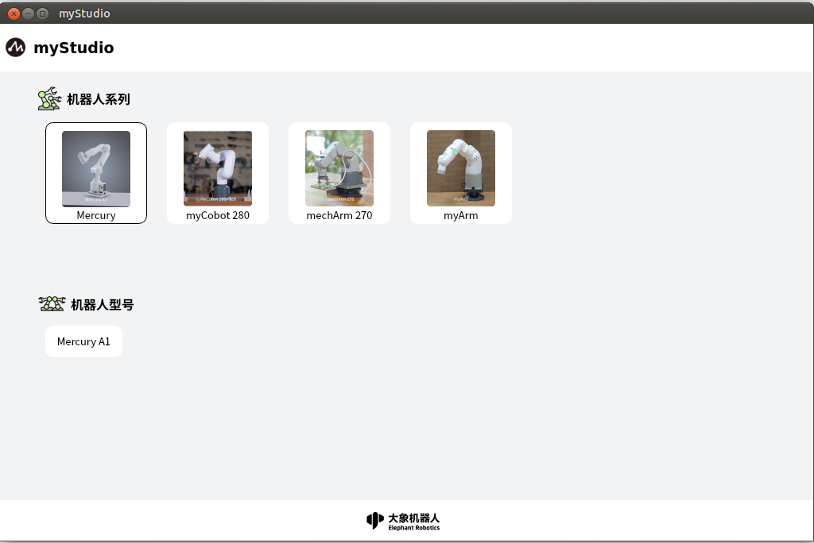
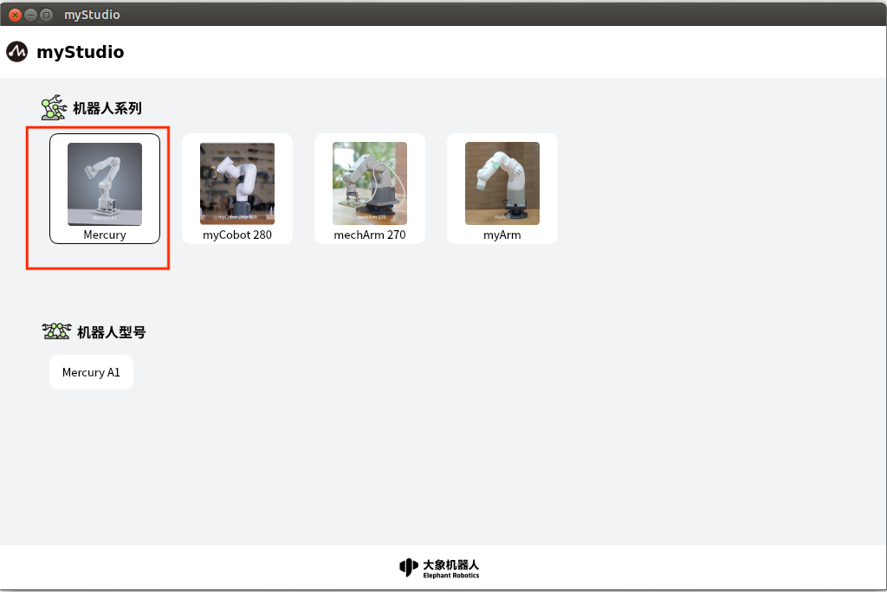
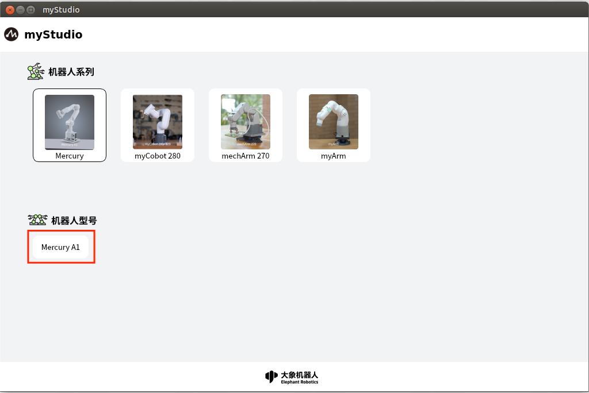

# 首页

初次打开应用，最开始会进入此页面，这里可以选择对应的机型。

这里展示了当前应用已经适配过的产品以及机型。

"**Robot Series**"为产品信息，可以根据你使用的产品进行选择，鼠标左键点击即选择对应机型。这里默认选择的是"**Mercury**"产品。

"**Robot Model**"为产品详细机型信息。选择不同的产品以后，此处会出现对应产品的机型选择信息。

鼠标左键点击产品具体的机型，会跳转到[功能页面](./2-robot_function.md)
