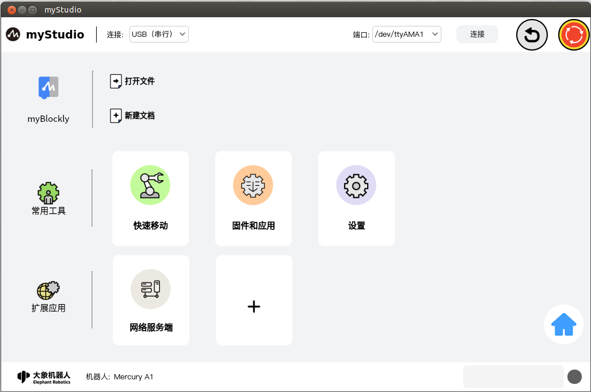
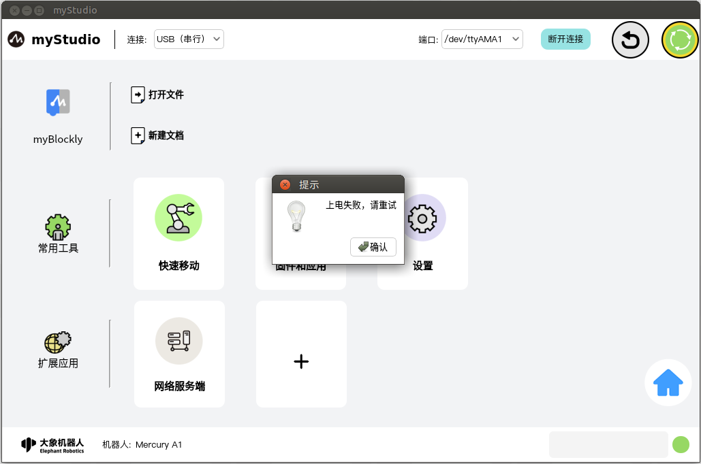
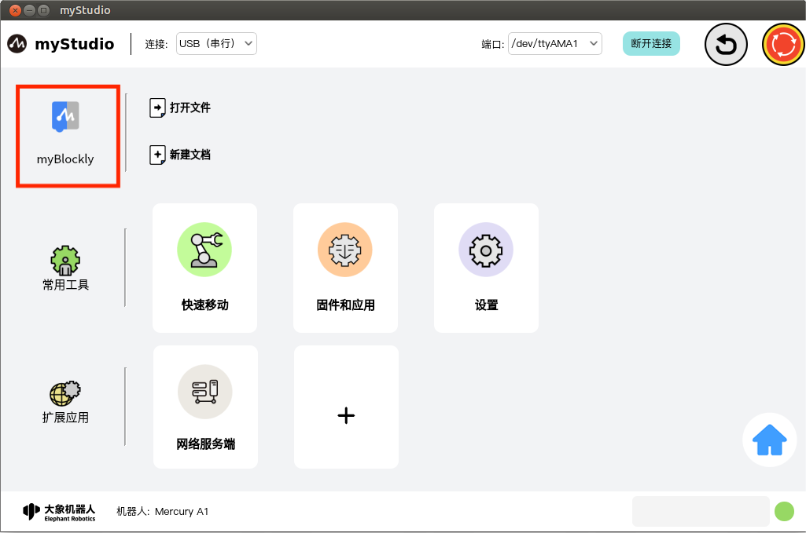
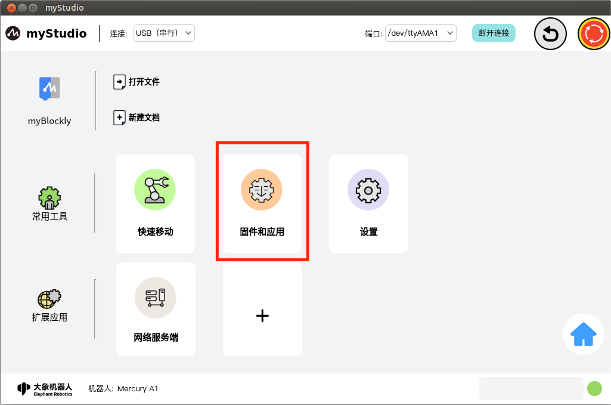

# 功能

页面主体：

界面功能介绍，界面分成三个区域：

1. 通信配置
2. 功能实现
3. 信息展示

> 注意：应用会记忆你选择的机型，下次打开应用的时候，会自动选择上次选中的机器，自动跳转到此界面。

## 通信配置

应用的最顶层部分，这里可以设置此应用与机器人之间的通信方式以及两个快捷的功能按钮

### 通信方式

可以选择通信方式，通信方式有一下两种：

1. USB(串口通信)
2. 网络通信

#### 1. USB(串口通信)

此方式仅适用于在机器人本体的系统内使用。鼠标左键点击通信方式选择下拉框，选择"**USB(串口通信)**"选项，"**端口**"选择"**/dev/ttyAMA1**"，接着点击"**连接**"即可。

点击"**连接**"以后并且成功连接以后，"**连接**"按钮会变成"**断开连接**"

#### 2. 网络通信

此通信方式适用于远程控制机器人，选择此方式的应用是作为客户端使用，所以需要搭配"**扩展应用**"中的"**网络服务端**"插件来使用。

##### 客户端

选择通信方式为"**网络通信**"，选择以后，需要输入服务端的 IP 地址以及端口号（服务端的 IP 地址以及端口号可以在，服务端的 myStudio"**扩展应用**"中的"**网络服务端**"插件中查看），再点击"**连接**"

##### 服务端

同样打开机器人系统内的 myStudio，进入"**扩展应用**"中的"**网络服务端**"插件，来开启服务端。

> 注意：当 myStudio 作为服务端时，应用"**顶部通信**"无需配置连接。

"**网络服务端**"插件的详细用法请查看[这里](../5-plugins/1-socket/5.1.1-socketfirstuse.md)，

### 回零

此按钮功能为：控制机器人所有关节都回到零位位置。

**注意**：此按钮功能生效的前提的已经成功连接机器人的通信。鼠标左键点击此按钮以后，机器人开始执行回零指令，应用整个界面会被一层透明浅灰色的阴影覆盖，回零未结束之前，不得点击界面内的其他功能，并且应用中心位置会显示正在回零的转圈图案提示。

如果未连接通信，点击此按钮会提示先连接设备通信。

正常连接通信以后：

回零完成以后，会弹窗提示完成回零。

回零功能的几种错误情况：

1. 回零超时失败：水星 A1 的回零超时时间为 30S，如果 30S 还没有回零成功，则会结束回零并且弹窗提示回零失败。
   

### 软件急停

此按钮功能为：控制机器人整机掉电。在"**连接**"设备通信以后，会检测当前机器人是否上电，如果已经上电，此按钮为红色状态；如果未上电，此按钮会改为绿色状态并且会弹窗提示机器人未上电，可以通过点击此按钮来上电。

**注意**：此按钮功能生效的前提的已经成功连接机器人的通信。

#### 上电

当此按钮为绿色图案时，此按钮的功能为上电。鼠标左键点击此按钮以后，机器人开始执行上电指令，应用整个界面会被一层透明浅灰色的阴影覆盖，上电未结束之前，不得点击界面内的其他功能，并且应用中心位置会显示正在上电的转圈图案提示。

上电完成以后, 图标会变成红色并且弹窗提示。

上电失败的几种情况：

1. 水星 A1 有上电超时 8S，如果在 8S 内没有上电成功，则会弹窗提示上电失败。
   

#### 下电

当此按钮为红色图案时，此按钮的功能为下电。鼠标左键点击此按钮以后，机器人开始执行下电指令，应用整个界面会被一层透明浅灰色的阴影覆盖，下电未结束之前，不得点击界面内的其他功能，并且应用中心位置会显示正在下电的转圈图案提示。

下电完成以后, 图标会变成绿色并且弹窗提示。

下电失败的几种情况：

1. 水星 A1 有下电超时 3S，如果在 SS 内没有下电成功，则会弹窗提示下电失败。
   

## 功能实现

这里可以选择你想要使用的功能，功能包含如下：

1. [blockly 图形化编程](#myblockly)
2. 快速移动
3. 固件与应用
4. 设置
5. 扩展插件
   1. 网络服务器
6. 返回机型选择界面

### myBlockly

`myBlockly`是一个完全可视的模块化编程软件，属于图形化编程语言，适合初级用户熟悉编程。使用者以拖拽拼图的方式开发出应用程序，即可创造出简单及复杂的功能。支持图形化代码的保存、加载、单步调试执行、执行指定的单个积木块等功能。

> 注意：想要使用 myBlockly 必须要先连接设备通信。

#### myBlockly

此处为可点击按钮，鼠标左键点击以后，会跳转到[myBlockly 图形化编程界面](../1-blockly/README.md)

#### 打开文件

此处为可点击按钮，可以通过导入 JSON 文件自动加载 blockly 积木块。

鼠标左键点击以后，会弹窗一个可以选择文件的弹窗，选择通过 blockly 保存的 JSON 文件可以加载该文件，打开 myBlockly 并且在编程界面自动载入对应的积木块。

#### 新建文件

此按钮与"[**myBlockly**](#myblockly-1)"功能一样。

#### 快捷载入历史保存的 blockly 文件

当你在使用过 myBlockly 编程并且已经保存过 blockly 文件，如下图示位置会显示保存的文件名称以及保存时间，显示数量最多为 4 个，如果超过 4 个，只显示最新保存的 4 个。鼠标左键点击可以打开 myBlockly 并且自动加载选中的 blockly 文件。

### 常用工具

#### 快速移动

功能：提供机器人 IO 快捷控制以及关节角度、坐标的快捷控制。

[功能详细介绍](/2-quickmove/2.1-quickmovefirstuse.md)

#### 固件与应用

功能：提供机器人嵌入式固件的更新升级、扩展应用管理、产品使用手册、官方视频、官方 GitHub 官方在线商城以及意见反馈功能。

[功能详细介绍](/3-firmware/README.md)

### 设置

功能：应用以及机器人基本信息的展示以及更改功能

[功能详细介绍](/4-setting/4.1-setting_main.md)

## 信息展示

应用的底层部分，包含大象机器人公司的 logo、当前选择机器的类型、警报提示以及当前机器人的运行状态。

### 报警提示

功能：展示机器人错误信息，并且鼠标左键双击可以打开错误日志窗口。

鼠标左键双击,打开错误日志窗口.

如果机器人在运行的过程中报错，应用就会捕获异常并且显示在错误日志界面中，错误日志表格内含义如下：

- number：错误日志序号
- time：错误发生的时间
- type：出现的错误类型
- description：错误描述信息

应用捕获到错误以后，首先会弹窗提示并且会给出解决方案，如果你不想处理错误，也可以忽略错误，忽略的同一个错误信息，如果未断开连接或者未进入到错误日志界面清除，本次应用内将不再弹窗提示。当你断开连接并且重新连接设备或者进入到错误日志界面，点击"**清除**"按钮以后，会重新弹窗提示并且保存到错误日志表中。

### 机器人运行状态

功能：显示当前机器人的运行状态

| Color                                                        | meaning  |
| ------------------------------------------------------------ | -------- |
|  | 未连接   |
|    | 正常待机 |
|   | 正在运动 |
|     | 机器异常 |

