# Function

Page body:

Introduction to interface functions, the interface is divided into three areas:

1. Communication configuration
2. Function implementation
3. Information display

> Note: The application will remember the model you selected. When you open the application next time, it will automatically select the last selected machine and automatically jump to this interface.

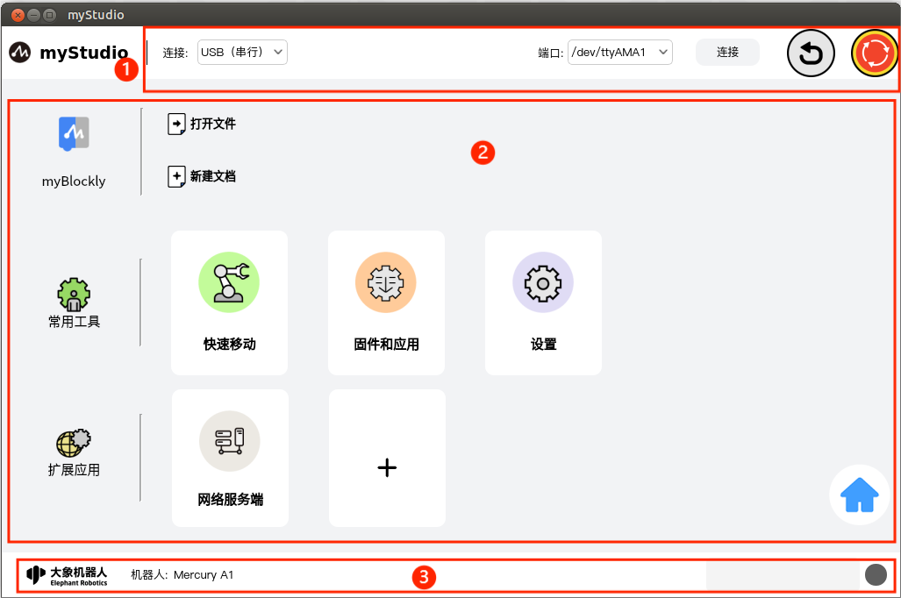

## Communication configuration

The top-level part of the application. Here you can set the communication method between this application and the robot and two shortcut function buttons.

### way of communication

You can choose the communication method. There are two communication methods:

1. USB (serial communication)
2. Network communication

#### 1. USB (serial communication)

This method is only suitable for use within the system of the robot body. Left-click the communication method selection drop-down box, select the "**USB (Serial Communication)**" option, select "**/dev/ttyAMA1**" for "**Port**", and then click "**Connect* *"That's it.

After clicking "**Connect**" and successfully connecting, the "**Connect**" button will change to "**Disconnect**"

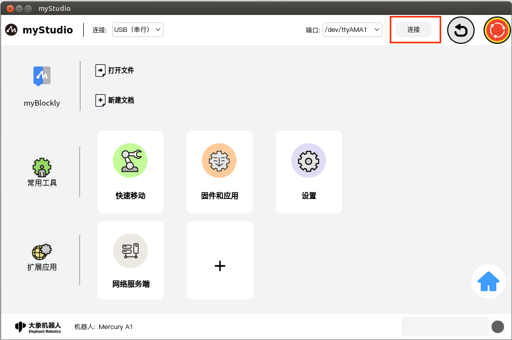

#### 2. Network communication

This communication method is suitable for remote control of robots. The application that selects this method is used as a client, so it needs to be used with the "**Network Server**" plug-in in "**Extended Application**".

##### Client

Select the communication method as "**Network Communication**". After selecting, you need to enter the IP address and port number of the server (the IP address and port number of the server can be found in the "**Extended Application**" of myStudio on the server) **Network Server**" plug-in to view), then click "**Connect**"
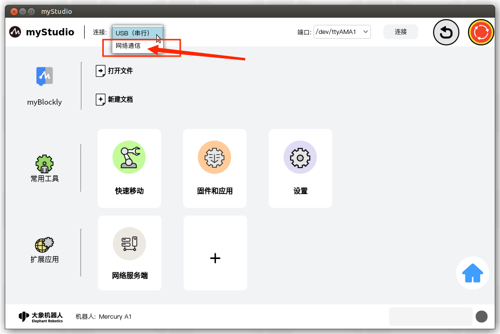

##### Server

Also open myStudio in the robot system and enter the "**Network Server**" plug-in in "**Extended Application**" to open the server.

> Note: When myStudio is used as the server, there is no need to configure the connection when applying "**Top Communication**".

For detailed usage of the "**Network Server**" plug-in, please see [here](../5-plugins/1-socket/5.1.1-socketfirstuse.md),

### Return to zero

The function of this button is to control all joints of the robot to return to the zero position.

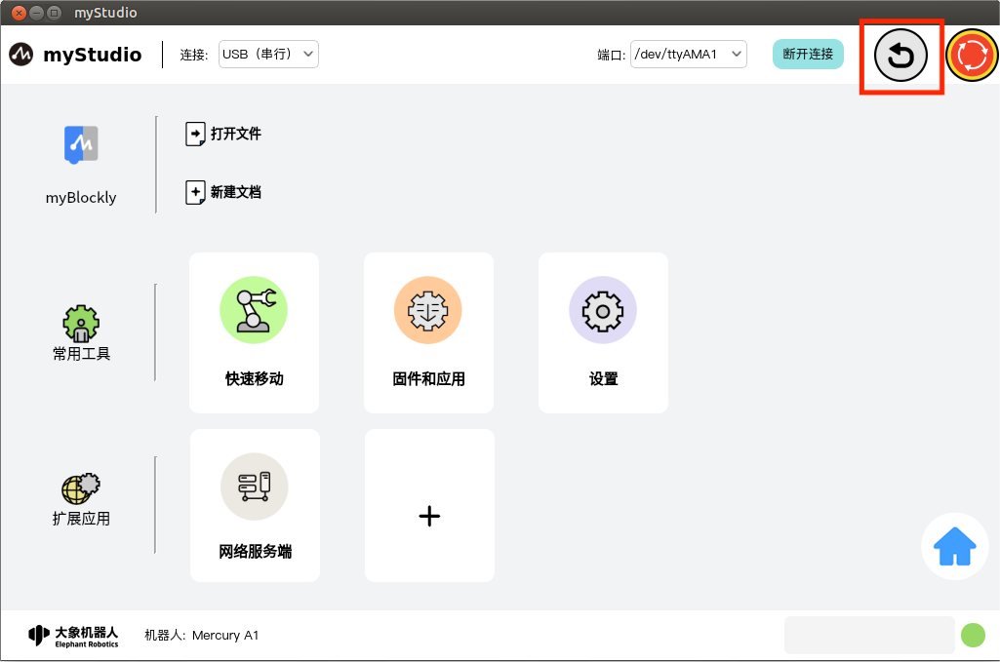

**Note**: The prerequisite for this button function to take effect is that the robot's communication has been successfully connected. After clicking this button with the left mouse button, the robot will start to execute the return-to-zero command. The entire application interface will be covered by a layer of transparent light gray shadow. Before the return-to-zero is completed, other functions in the interface are not allowed to be clicked, and the center of the application will be displayed. The circle pattern prompts for returning to zero.

If communication is not connected, clicking this button will prompt you to connect device communication first.

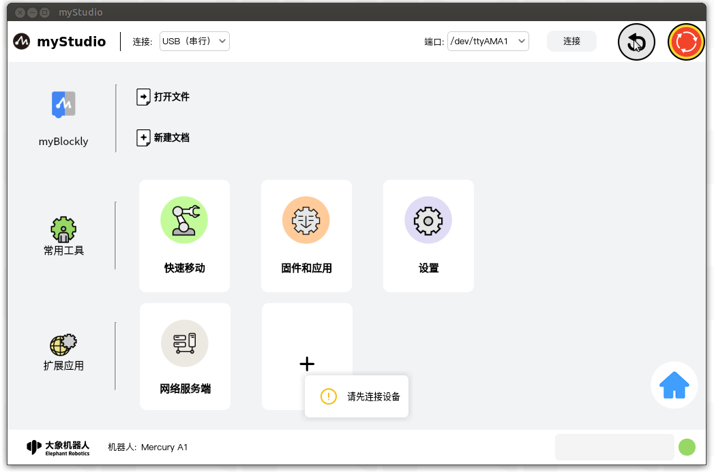
After normal connection and communication:

After the zero return is completed, a pop-up window will prompt that the zero return is completed.

Several error conditions of the zero return function:

1. Zero return timeout failure: The zero return timeout of Mercury A1 is 30S. If the zero return is not successful within 30 seconds, the zero return will end and a pop-up window will prompt that the zero return failed.
    

### Software emergency stop

The function of this button is to control the robot to power off. After the "**Connect**" device communicates, it will detect whether the current robot is powered on. If it is powered on, this button will be red; if it is not powered on, this button will change to green and a pop-up window will prompt that the robot is not powered on. Power on, you can power on by clicking this button.

**Note**: The prerequisite for this button function to take effect is that the robot's communication has been successfully connected.

#### Power-on

When this button has a green pattern, the function of this button is to power on. After clicking this button with the left mouse button, the robot will start to execute the power-on command. The entire application interface will be covered by a layer of transparent light gray shadow. Before the power-on is completed, other functions in the interface are not allowed to be clicked, and the center of the application will display "Active". The turning circle pattern prompts when the power is turned on.

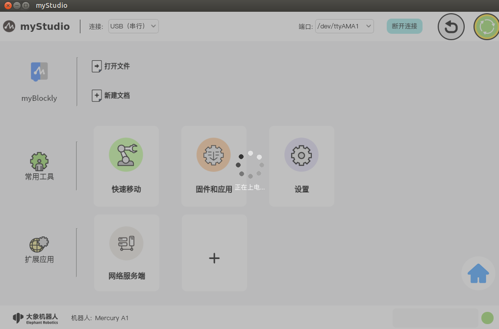

After power-on is completed, the icon will turn red and a pop-up window will appear.

Several situations of power-on failure:

1. Mercury A1 has a power-on timeout of 8S. If the power-on is not successful within 8S, a pop-up window will prompt that the power-on failed.
    

#### Power off

When this button has a red pattern, its function is to power off. After clicking this button with the left mouse button, the robot will start to execute the power-off command. The entire application interface will be covered by a layer of transparent light gray shadow. Before the power-off is completed, other functions in the interface are not allowed to be clicked, and the center of the application will display "Processing". The circle pattern prompts when powering off.

After powering off, the icon will turn green and a pop-up window will appear.

Several situations in which power off fails:

1. Mercury A1 has a power-off timeout of 3S. If the power-off is not successful within SS, a pop-up window will appear indicating that the power-off failed.
    

## Function implementation

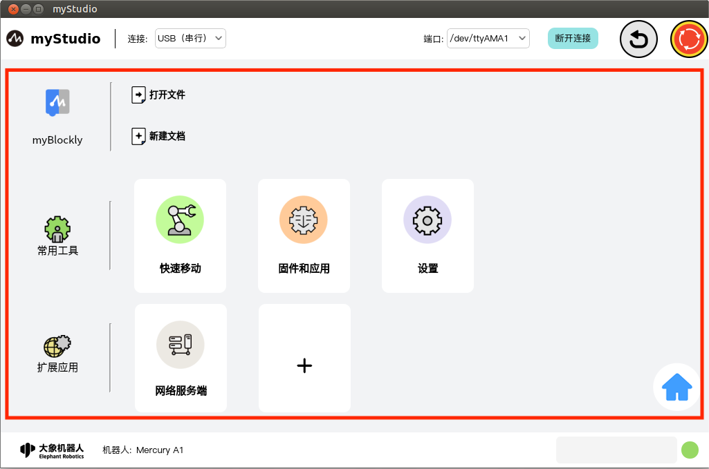

Here you can choose the functions you want to use. The functions include the following:

1. [blockly graphical programming](#myblockly)
2. Move quickly
3. Firmware and Applications
4. Settings
5. Extension plug-ins
    1. Web server
6. Return to the model selection interface

### myBlockly

`myBlockly` is a completely visual modular programming software, which is a graphical programming language and suitable for beginner users to get familiar with programming. Users develop applications by dragging and dropping puzzle pieces to create simple and complex functions. Supports functions such as saving, loading, single-step debugging and execution of graphical code, and executing specified individual building blocks.

> Note: If you want to use myBlockly, you must first connect to device communication.

#### myBlockly

This is a clickable button. After clicking with the left mouse button, it will jump to [myBlockly graphical programming interface](../1-blockly/README.md)

#### Open file

Here is a clickable button that automatically loads blockly blocks by importing a JSON file.

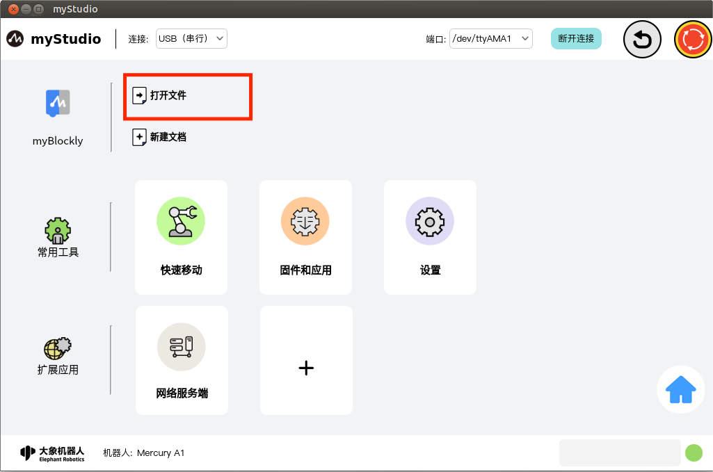

After left-clicking the mouse, a pop-up window will pop up to select a file. Select the JSON file saved through blockly to load the file, open myBlockly and automatically load the corresponding building block in the programming interface.

#### New file

This button has the same function as "[**myBlockly**](#myblockly-1)".

#### Quickly load blockly files saved in history

When you have used myBlockly programming and have saved blockly files, the saved file names and save time will be displayed in the location shown below. The number displayed is up to 4. If there are more than 4, only the latest 4 saved files will be displayed. Click with the left mouse button to open myBlockly and automatically load the selected blockly file.

### ToolS

#### Quick Move

Function: Provides quick control of robot IO and quick control of joint angles and coordinates.

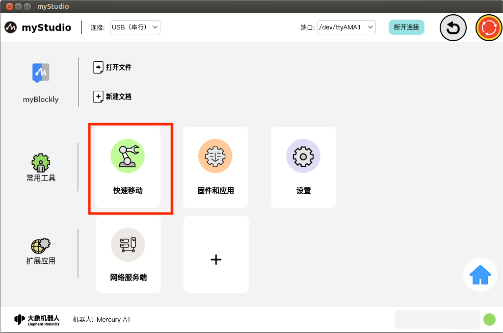

[Detailed introduction of functions](/2-quickmove/2.1-quickmovefirstuse.md)

#### Firmware Applications

Function: Provides robot embedded firmware updates and upgrades, extended application management, product manuals, official videos, official GitHub official online mall, and feedback functions.

[Detailed introduction of functions](/3-firmware/README.md)

#### Setting

Function: Display of basic information about applications and robots and change functions

[Detailed introduction of functions](/4-setting/4.1-setting_main.md)

### Extensions

This contains extension plug-ins. Currently, there is a "**Network Server**" plug-in, and there is a quick way to add a jump button.

#### Socket Server

You can open a network server to remotely control the robot

[Detailed introduction of functions](/5-plugins/1-socket/5.1.1-socketfirstuse.md)

#### Add

Click this button with the left mouse button to jump to the "**Application**" interface of the "**Firmware Appliactions**" interface.

[Detailed introduction of functions](/3-firmware/3.2-firmware_app.md)

#### Return

Click this button with the left mouse button to return to [Homepage](/0-community/1-robot_choose.md) and reselect the model.

## Information display

The underlying part of the application includes the logo of Elephant Robot Company, the type of currently selected machine, alarm prompts, and the current running status of the robot.

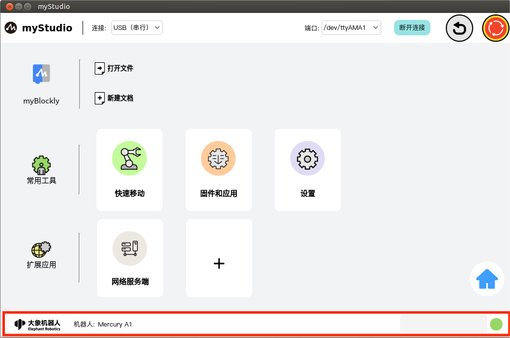

### Alarm prompt

Function: Display robot error information, and double-click the left mouse button to open the error log window.

Double-click with the left mouse button to open the error log window.

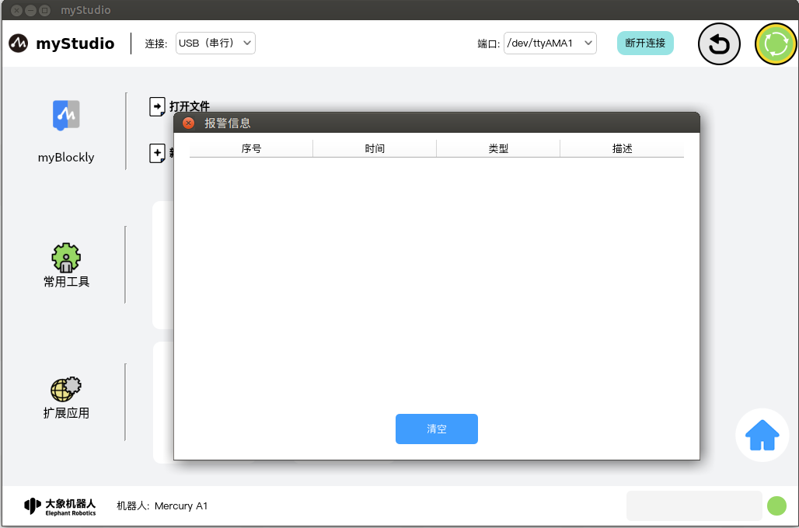

If the robot reports an error during operation, the application will capture the exception and display it in the error log interface. The meaning of the error log table is as follows:

- number: error log sequence number
- time: the time when the error occurred
- type: the type of error that occurred
- description: error description information

After the application captures the error, it will first pop up a prompt and provide a solution. If you do not want to deal with the error, you can also ignore the error. The same error message is ignored. If the connection is not disconnected or the error log interface is not entered, clear it. There will be no pop-up prompts in this application. When you disconnect and reconnect the device or enter the error log interface and click the "**Clear**" button, the window prompt will pop up again and saved in the error log table.

### Robot running status

Function: Display the current running status of the robot

| Color | meaning |
| ------------------------ | -------- |
|  | Not connected |
|  | Normal standby |
|  | Moving |
|  | Machine exception |