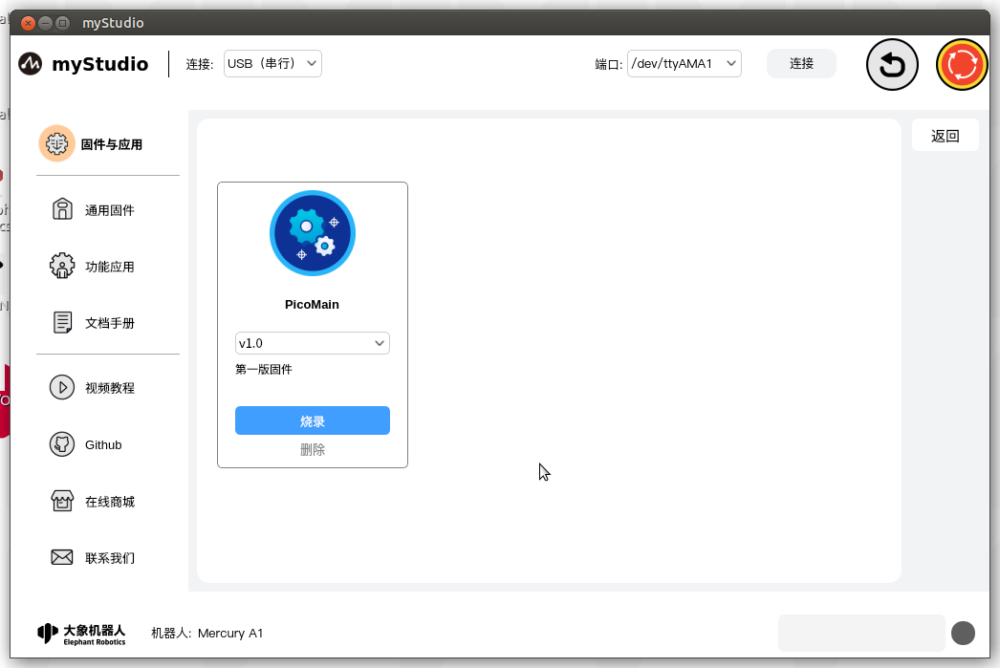
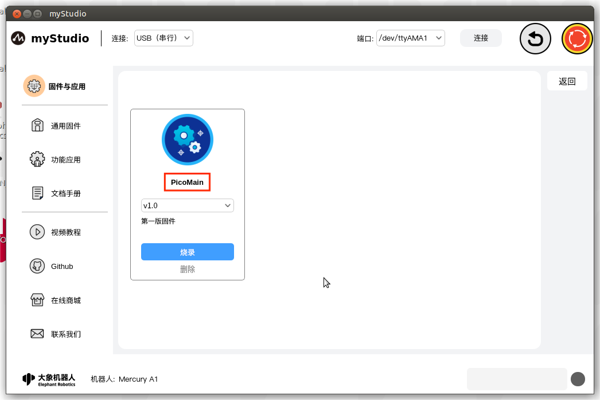
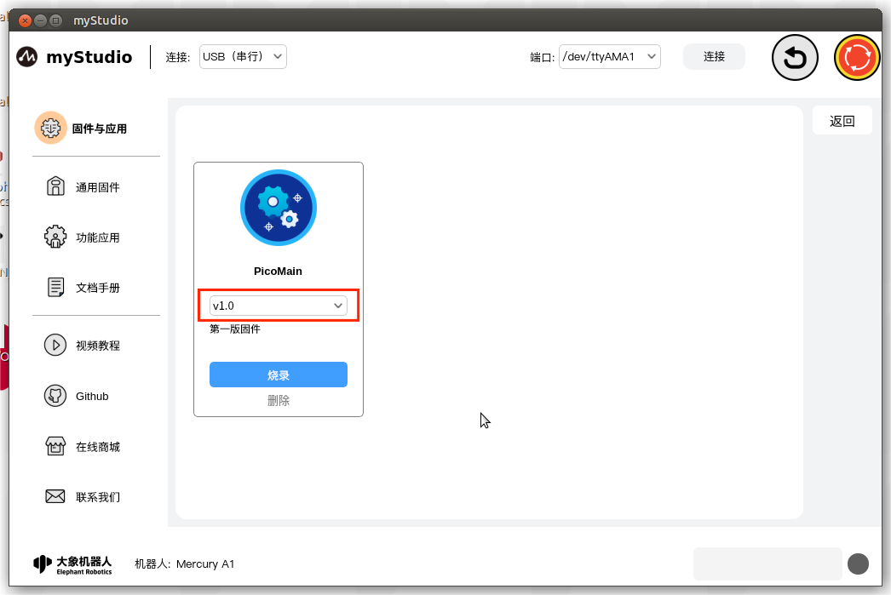
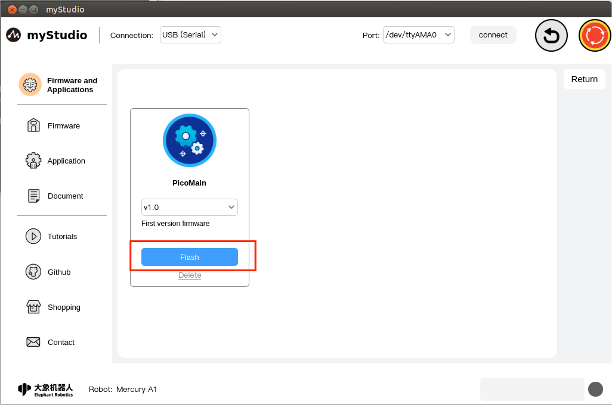
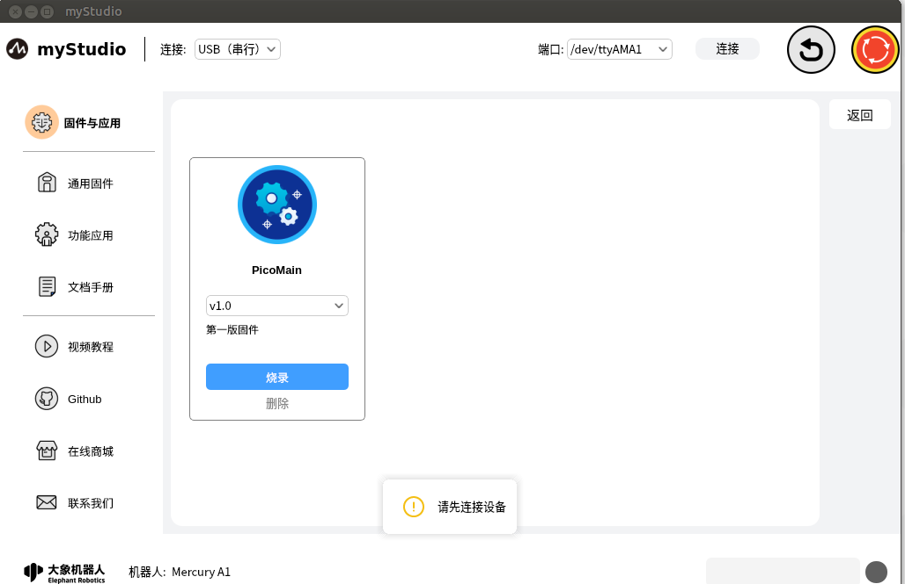
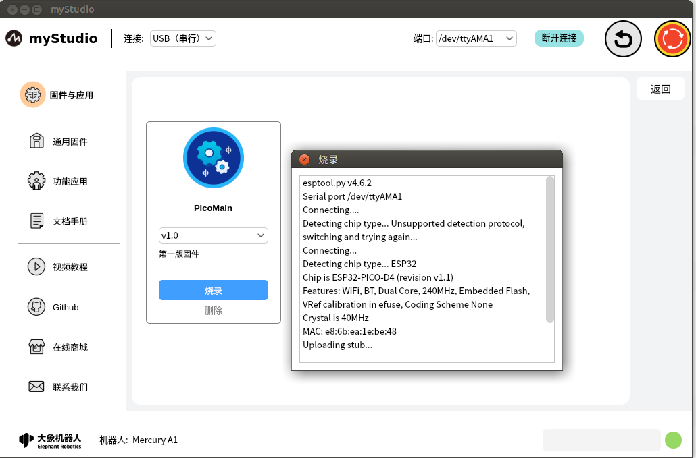
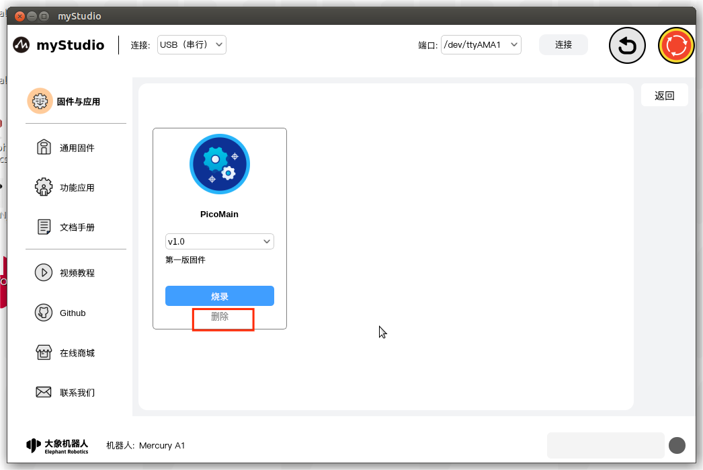
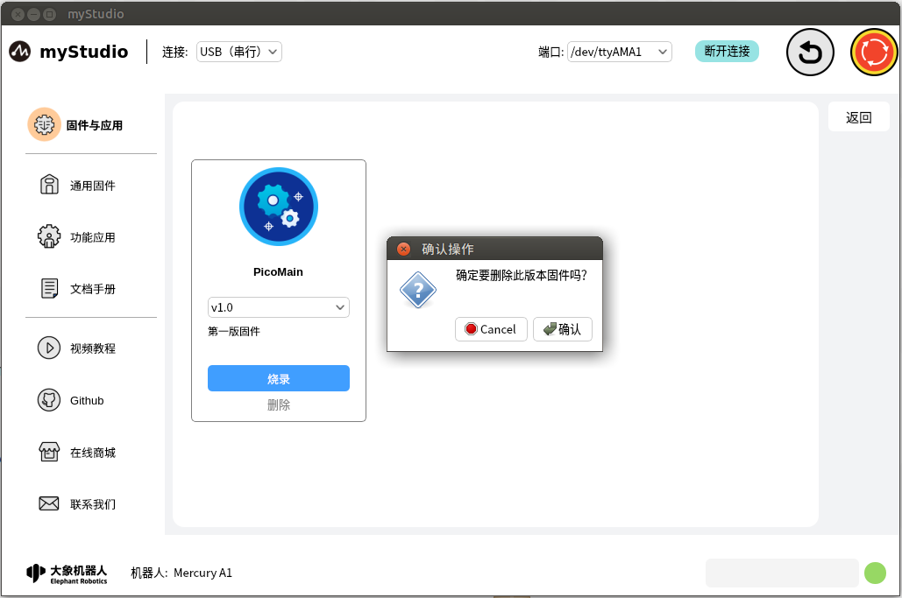
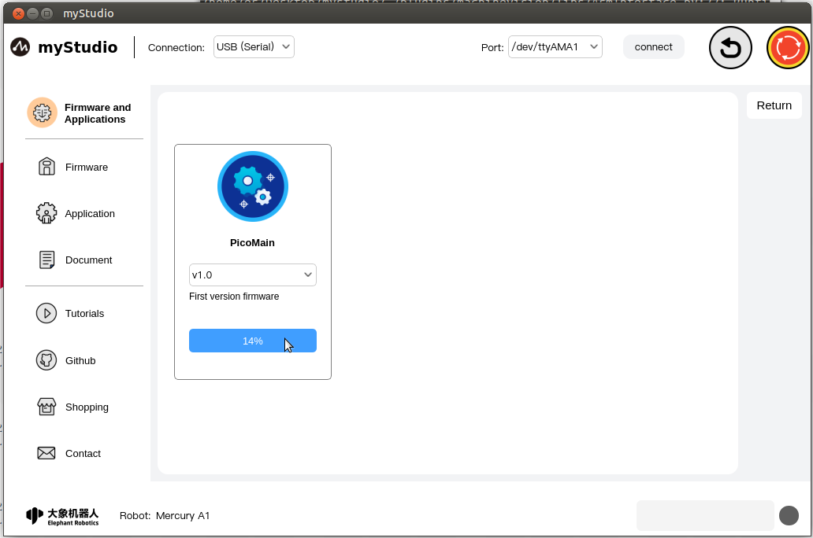

# 固件与应用-通用固件

## 页面主体介绍

首页如下图：

水星A1支持用户远程升级并且烧录最新版本的主控固件，机器出厂默认是使用的最新版本的固件，后续有新版本的固件发布，只需要在使用myStudio的时候保持网络畅通连接，myStudio会自动下载最新版本的固件。

功能介绍：

### PicoMian

主控固件名称

### 版本号

默认是最新已经发布的固件版本，也可以选择其他的版本进行烧录

### 描述信息

固件对应版本的描述信息，一般会包含此版本固件的更新信息

### 烧录

烧录按钮：固件烧录按钮，点击此按钮会自动开始烧录固件

> 注意：在烧录之前要先连接设备通信，否则会提示无法烧录

连接设备通信以后，正常烧录过程如下图：

烧录成功以后，会自动关闭烧录信息窗口，并且弹窗提示烧录完成。

### **删除**

删除按钮：固件删除按钮，用于删除存储在本地指定版本的固件

点击此按钮，会弹出提示信息，提示你确认是否要删除固件，点击"**确定**"按钮，表示确认删除；点击"**取消**"按钮，表示取消删除。

当有新版本的固件或者删除固件以后，"**烧录**"按钮就会变成"**下载**"按钮，并且"**删除**"按钮会消失，点击"**下载**"会自动下载固件。

下载完成以后，会恢复"**烧录**"和"**删除**"按钮。
