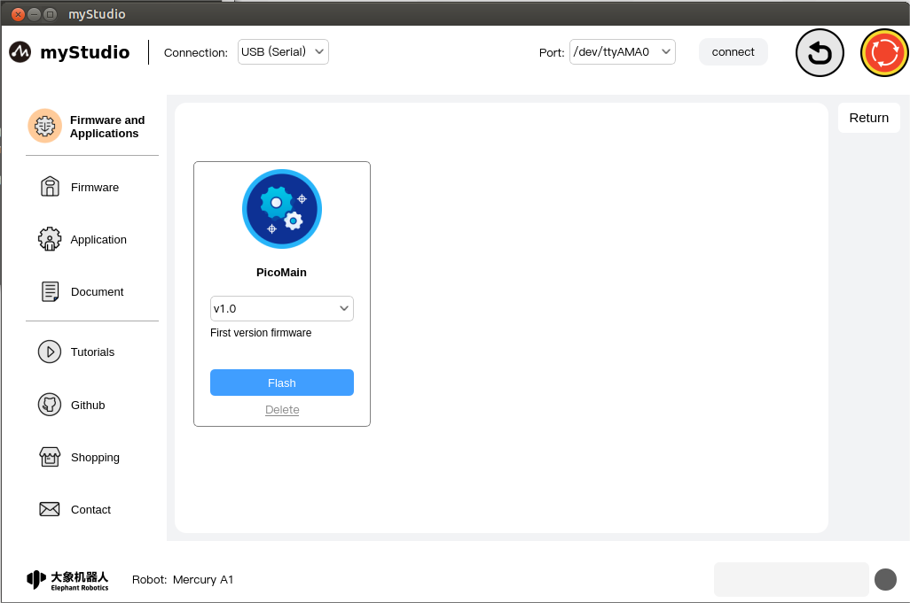
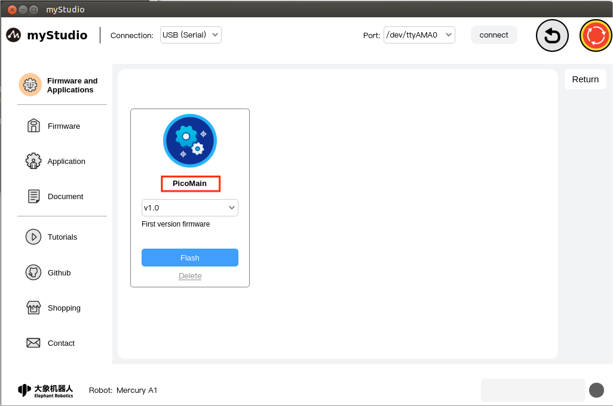
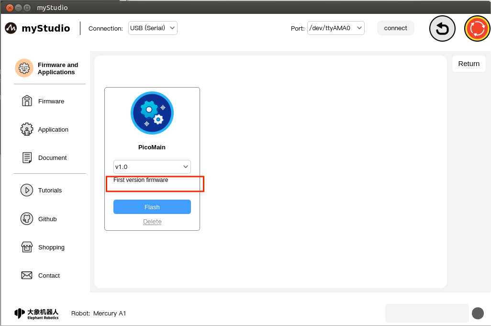
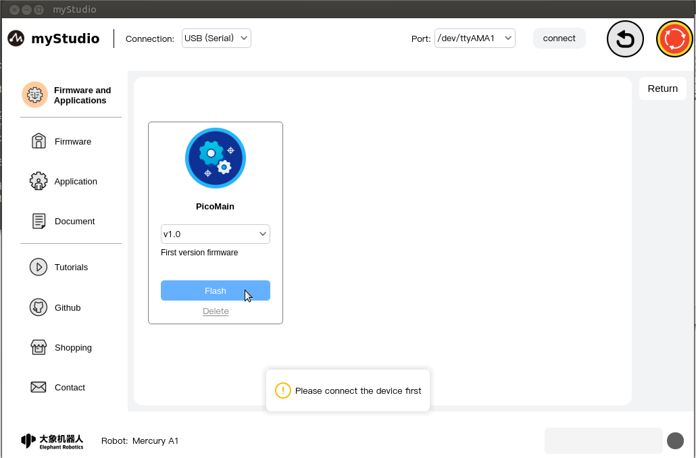
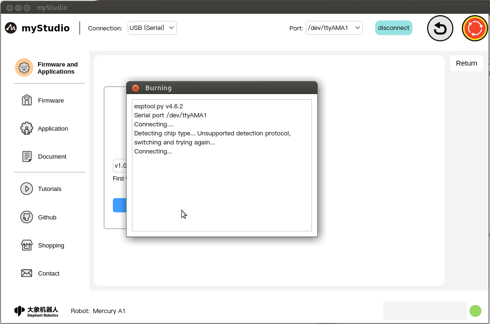
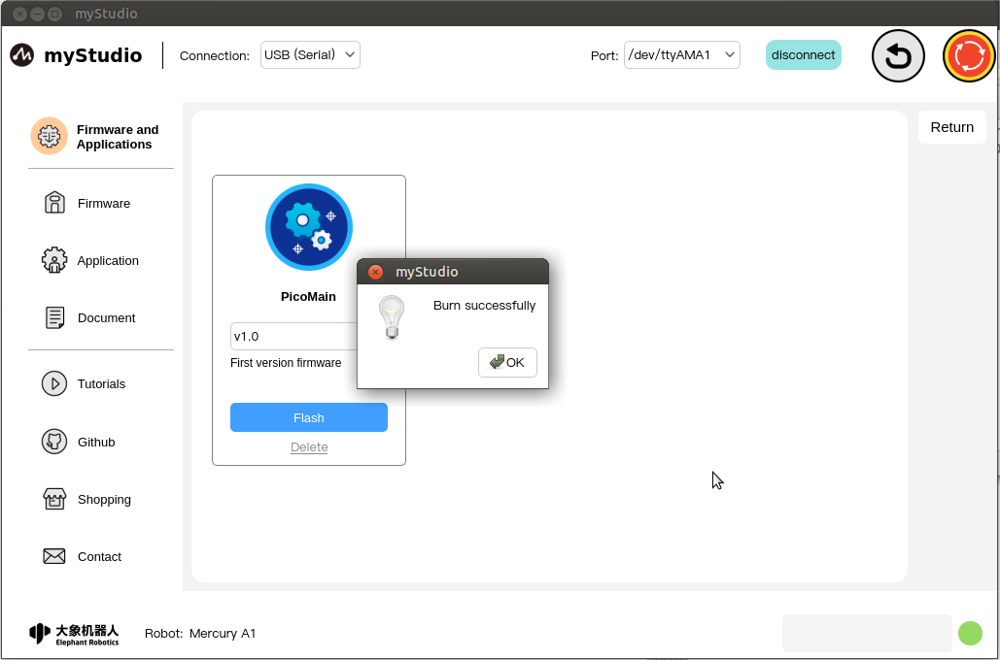
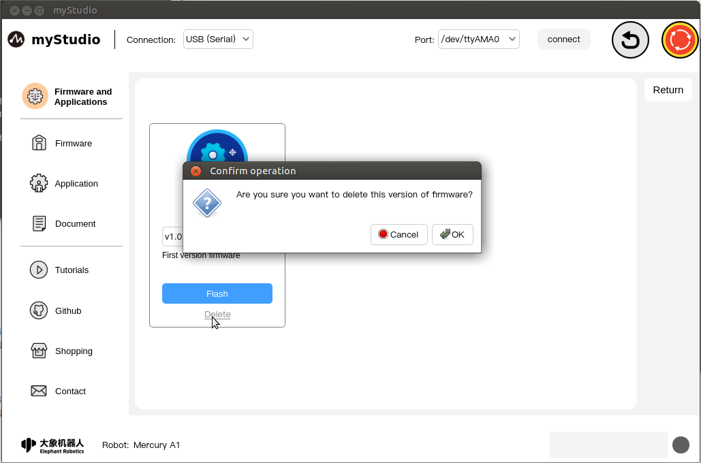

# Firmware and Applications - Firmware

## Introduction to page body

The home page is as shown below:

Mercury A1 supports users to remotely upgrade and burn the latest version of the main control firmware. The machine defaults to the latest version of firmware. When new versions of firmware are released later, you only need to keep the network open when using myStudio, and myStudio will automatically Download the latest version of firmware.

Features:

### PicoMian

Main control firmware name

### version number

The default is the latest released firmware version, you can also choose other versions for burning

### Description

The description information of the corresponding version of the firmware, which generally includes the update information of this version of the firmware.

### Flash

Burn button: Firmware burning button. Clicking this button will automatically start burning the firmware.

> Note: You must connect the device for communication before burning, otherwise you will be prompted that burning cannot be done.

After connecting to the device for communication, the normal burning process is as shown below:

After the burning is successful, the burning information window will be automatically closed, and a pop-up window will prompt that the burning is completed.

### **delete**

Delete button: Firmware delete button, used to delete the specified version of firmware stored locally

Click this button, and a prompt message will pop up, prompting you to confirm whether you want to delete the firmware. Click the "**OK**" button to confirm the deletion; click the "**Cancel**" button to cancel the deletion.

When there is a new version of firmware or the firmware is deleted, the "**Flash**" button will change to the "**Download**" button, and the "**Delete**" button will disappear. Click "**Download" **"The firmware will be downloaded automatically.

After the download is completed, the "**Flash**" and "**Delete**" buttons will be restored.