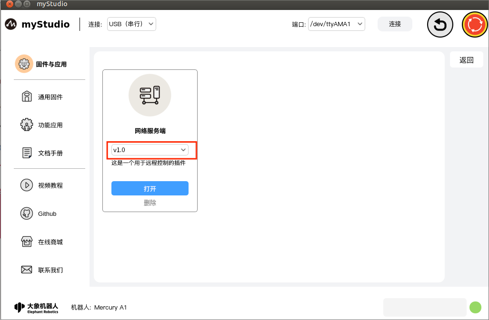
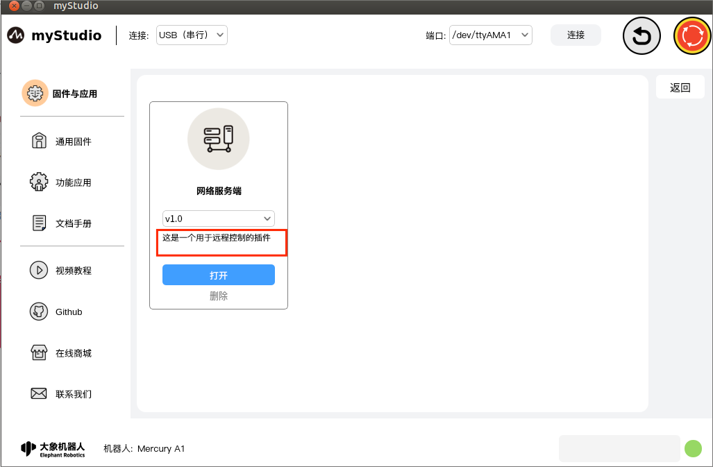
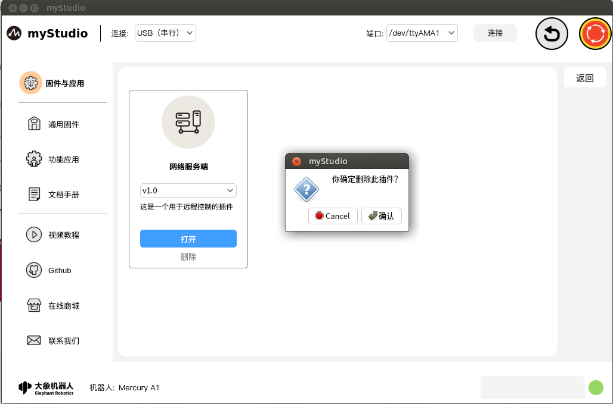
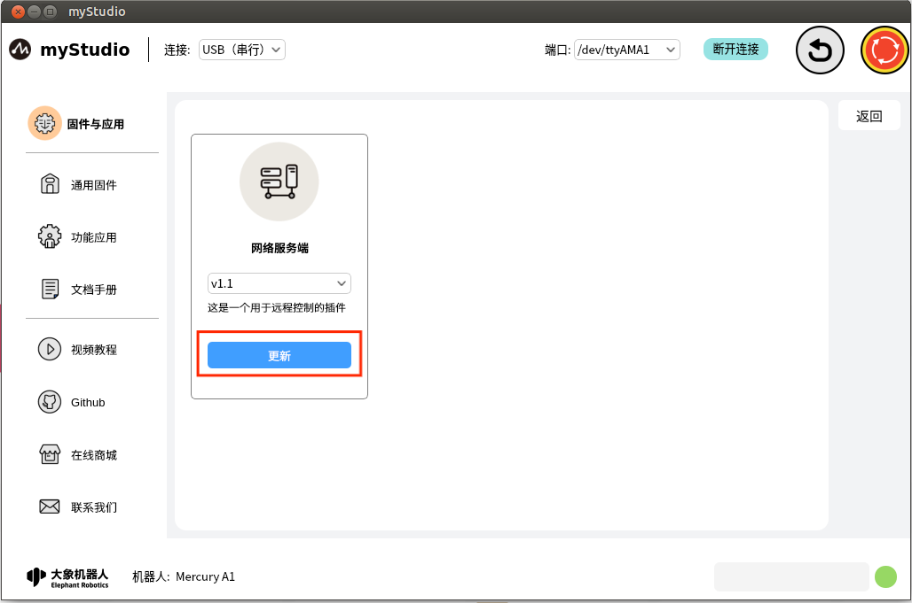

# 固件与应用-功能应用

## 页面主体介绍

此页面显示扩展插件的相关信息，包含插件的名称、版本、用途、入口、安装、更新以及删除功能。

插件功能介绍：

### 网络服务端

插件名称，表示此插件的命名

### 版本号

插件当前的版本号，仅展示，不支持切换版本。

### 描述信息

插件的描述信息，一般包含插件用途以及更新信息。

### 打开

进入插件的入口，点击此按钮，可以打开此插件，跳转到插件的主页面。

### 删除

可以删除当前插件，点击此按钮会弹窗提示，提示你是否确认删除。点击"**确认**"，将会删除此插件；点击"**取消**"，则不删除。

### 安装

如果删除了插件或者有其他新的插件可以下载，"**打开**"按钮会变成"**安装**"按钮，并且"**删除**"按钮会消失。

点击此按钮以后，会自动下载并且安装插件。

### 更新

更新插件，如果插件有新的版本更新，用户可以远程升级插件，更新插件以后，下次重启应用生效。

