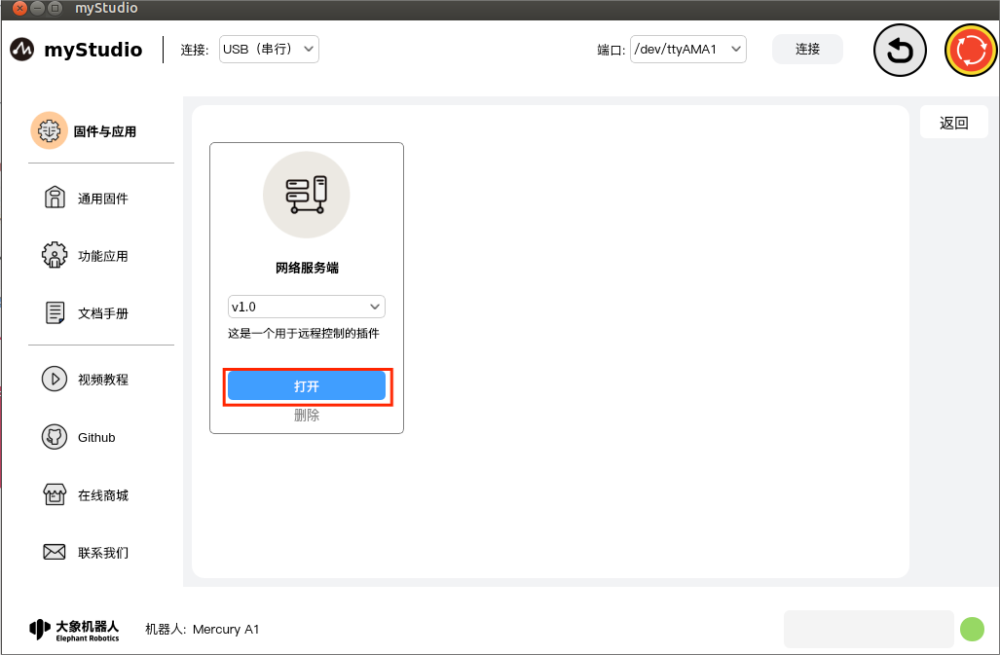
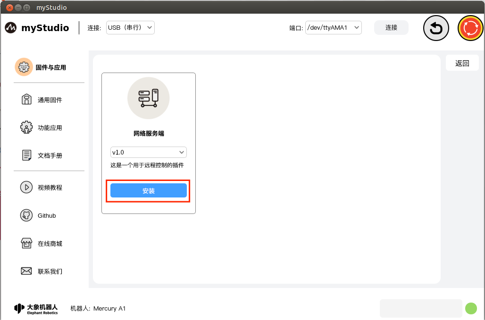
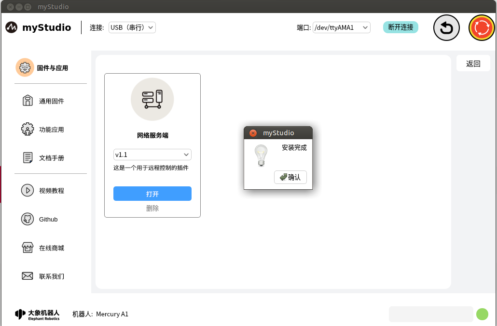

# Firmware and Application - Application

## Introduction to page body

This page displays information about the extension, including its name, version, purpose, entry, installation, update, and deletion functions.

Plug-in function introduction:

### Network server

Plugin name, indicating the name of this plugin

### version number

The current version number of the plugin is only displayed and does not support switching versions.

### Description

Plug-in description information, generally including plugin usage and update information.

### Open

Enter the plugin entrance and click this button to open the plugin and jump to the main page of the plugin.

### Delete

You can delete the current plugin. Click this button and a pop-up window will prompt you to confirm the deletion. Click "**Confirm**" to delete this plugin; click "**Cancel**" to not delete it.

### Install

If the plugin is deleted or other new plugins are available for download, the "**Open**" button will change to the "**Install**" button, and the "**Delete**" button will disappear.

After clicking this button, the plugin will be automatically downloaded and installed.

### Update

Update the plugin. If the plugin has a new version update, the user can remotely upgrade the plugin. After the plugin is updated, it will take effect next time the application is restarted.

