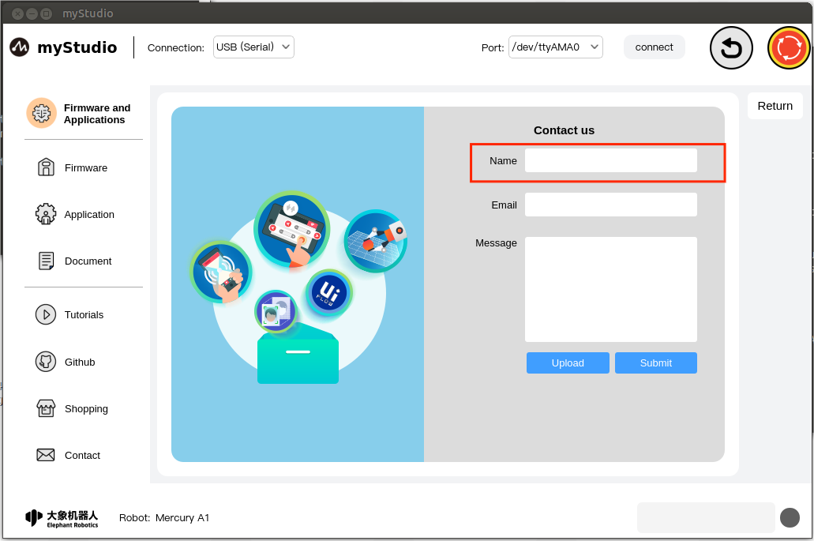
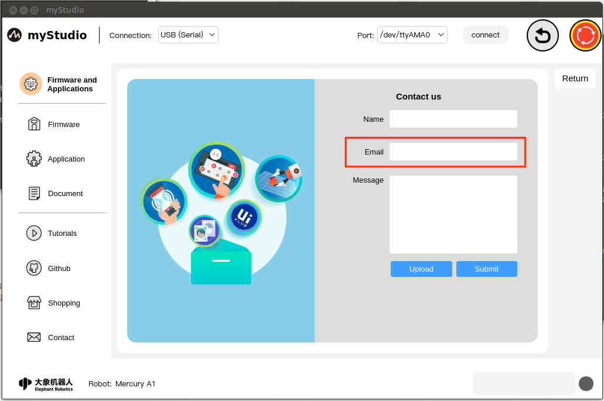
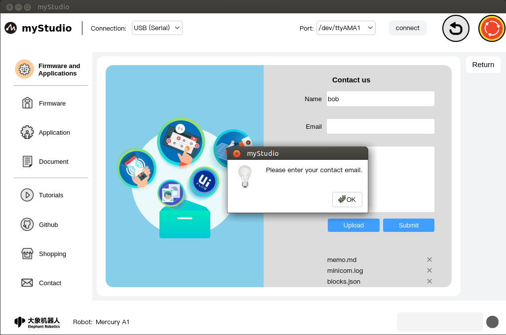
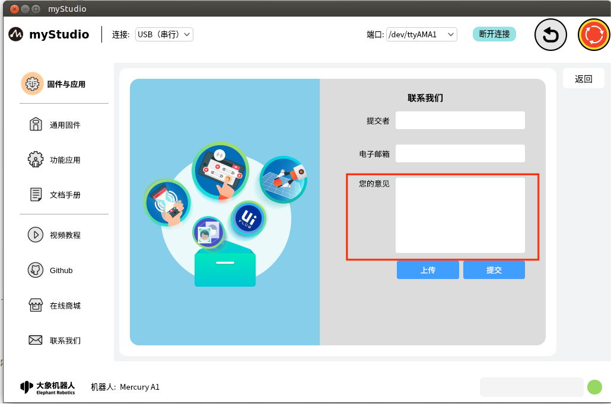
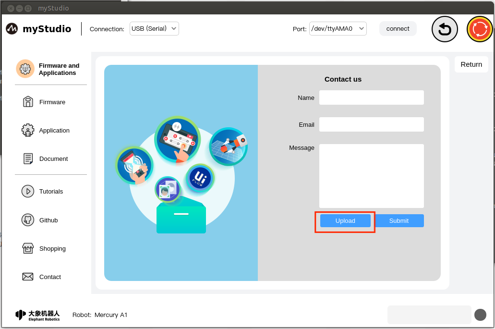
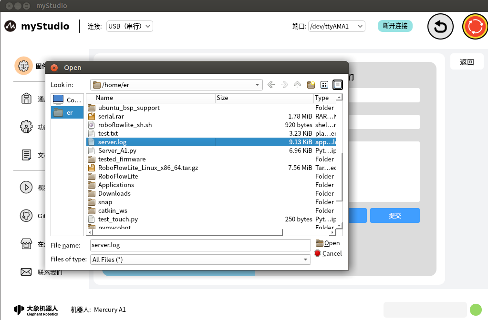
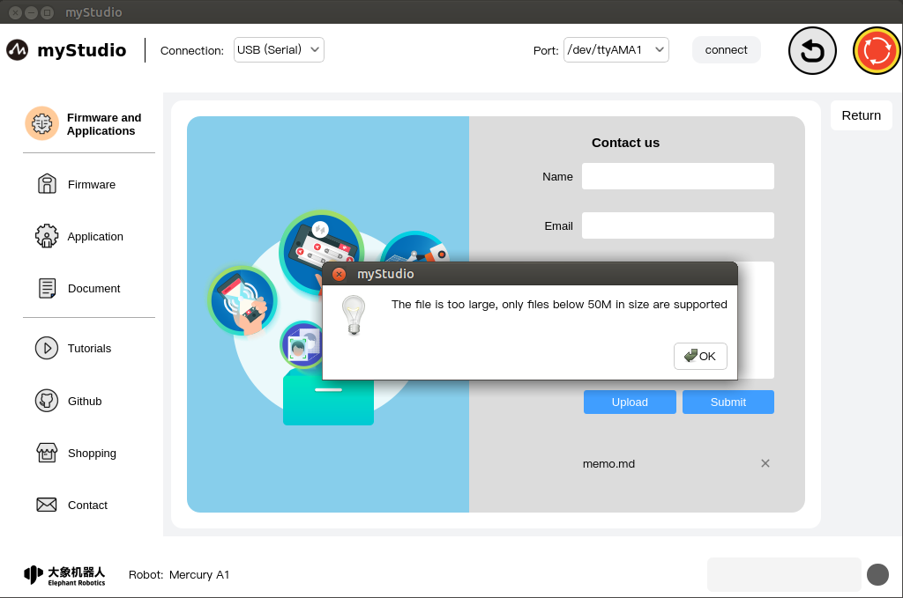

# Firmware & Applications - Contact

If you have any questions or ideas, you can contact us here.

Features:

### Name

You can enter your nickname here

> This is a required field. If you submit without filling it in, a pop-up window will prompt you.

### E-mail

You can enter your email address here so that official staff can reply to you later.

> This is a required field. If you submit without filling it in, a pop-up window will prompt you.

### your opinion

You can enter your questions or ideas here

### Upload

Click this button to upload files. Up to 3 files can be uploaded, and each file must not exceed 50M.

After clicking, a pop-up window will pop up for file selection.

If the size of the file you select exceeds 50M, after clicking "**Open**", the opening will fail and a pop-up window will prompt you that the file is too large.

When the number of files you want to upload exceeds 3, a pop-up window will prompt you.

