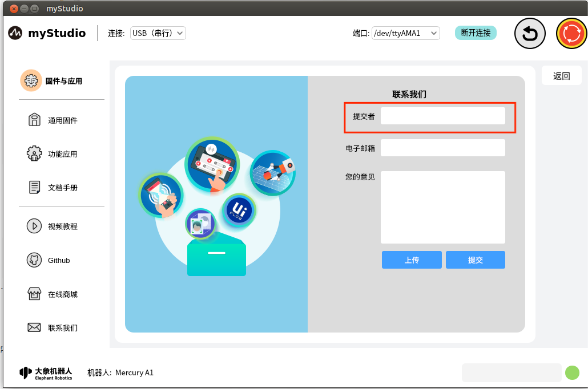
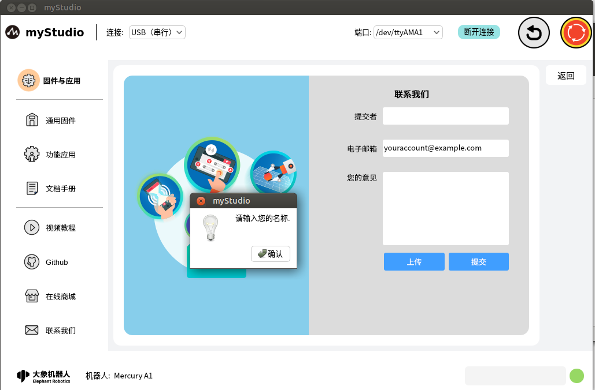
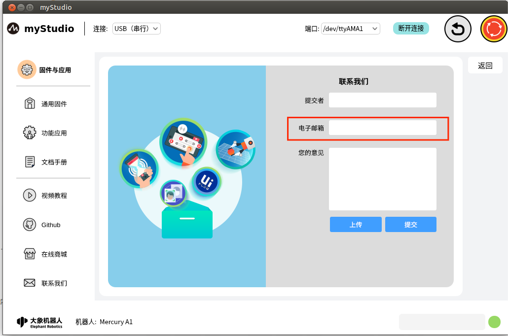
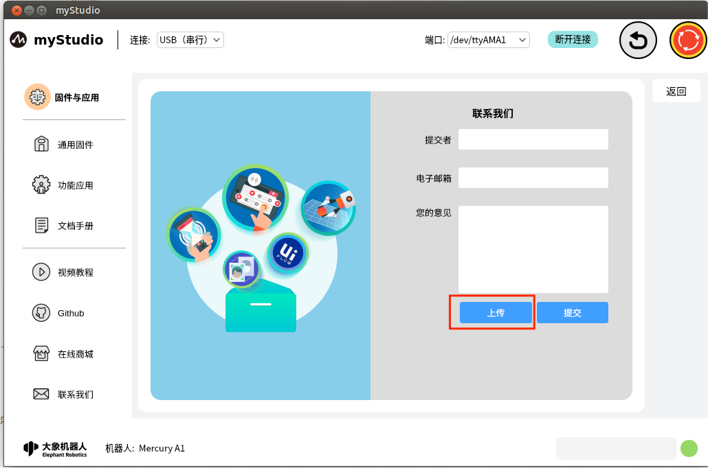
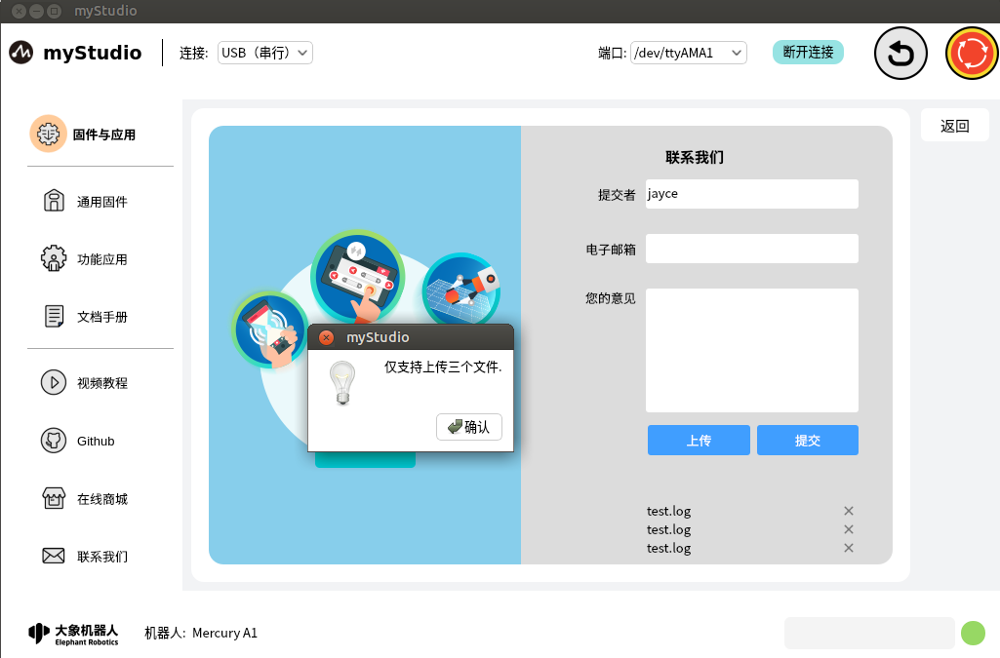

# 固件与应用-联系我们

如果你有任何的问题或者想法，可以通过这里来联系我们。

功能介绍：

### 名称

这里可以输入你的昵称

> 此处是必填项，如果你不填直接提交，会弹窗提示你。

### 电子邮箱

这里可以输入你的邮箱地址，方便官方人员后续回复你。

> 此处是必填项，如果你不填直接提交，会弹窗提示你。

### 您的意见

这里可以输入你的问题或者想法

### 上传

点击此按钮，可以上传文件，最多上传3个文件，并且每个文件不得超过50M.

点击以后会弹窗以供选择文件

如果你选中的文件大小超过50M，在点击"**打开**"以后，会打开失败，并且弹窗提示你文件过大。

当你要上传的文件数量超过3个时，会弹窗提示你。

